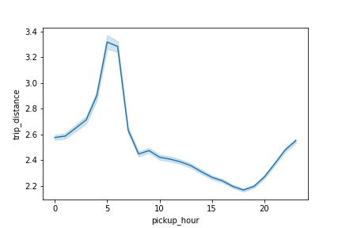

# NYC-Green-Taxi
The [NYC_green_taxi.ipynb](NYC_green_taxi.ipynb) consists of the entire code for the project.

# Table of Contents (with hyperlinks)
 * [Data](#O)
 * [Characterize the data and comment about its quality](#A)
    * [Data Cleaning](#A.1)
 * [Explore and visualize the data e.g. a histogram of trip distance](#B) 
 * [Find interesting trip statistics grouped by hour](#C)
    * [Feature Engineering](#C.1)
 * [The taxi drivers want to know what kind of trip yields better tips. Can you build a model for them and explain the model](#D)
    * [Initial Analysis](#D.1)
    * [Data Cleaning for tip classification and prediction](#D.2)
    * [Feature Engineering for tip classification and prediction](#D.3)
    * [Exploratory data analysis using visualizations](#D.4)
    * [Classification using random forest to identify feature importance](#D.5)
    * [Classification using gradient boosting algorithm](#D.6)
    * [Regression analysis](#D.7)
    * [Conclusion](#D.8)
  * [Visualize the data to help understand trip patterns](#E)
    * [VendorID](#E.1)
    * [Store and fwd flag](#E.2)
    * [Rate Code ID](#E.3)
    * [Passenger count](#E.4)
    * [Pickups and dropoffs](#E.5)
    * [Total Amount](#E.6)
  

## Data<a id="O"></a>
Let's first load the data and look at the shape of the dataframe
```
df1.shape
```
(1224158, 18)

Let's get a peek into the data:
Field Name Description

- VendorID: A code indicating the LPEP provider that provided the record.

         1= Creative Mobile Technologies, LLC; 
         2= VeriFone Inc.
- lpep_pickup_datetime: The date and time when the meter was engaged.

- lpep_dropoff_datetime The date and time when the meter was disengaged.

- Passenger_count: The number of passengers in the vehicle.

             This is a driver-entered value.
- Trip_distance: The elapsed trip distance in miles reported by the taximeter.

- PULocationID: TLC Taxi Zone in which the taximeter was engaged

- DOLocationID: TLC Taxi Zone in which the taximeter was disengaged

- RateCodeID: The final rate code in effect at the end of the trip.

         1= Standard rate
         2=JFK
         3=Newark
         4=Nassau or Westchester
         5=Negotiated fare
         6=Group ride
- Store_and_fwd_flag: This flag indicates whether the trip record was held in vehicle memory before sending to the vendor, aka “store and forward,” because the
  vehicle did not have a connection to the server.

         Y= store and forward trip
         N= not a store and forward trip
- Payment_type A numeric code signifying how the passenger paid for the trip.

        1= Credit card
        2= Cash
        3= No charge
        4= Dispute
        5= Unknown
        6= Voided trip
- Fare_amount: The time-and-distance fare calculated by the meter.

- Extra: Miscellaneous extras and surcharges. Currently, this only includes

            the $0.50 and $1 rush hour and overnight charges.
- MTA_tax: $0.50 MTA tax that is automatically triggered based on the metered rate in use.

- Improvement_surcharge: $0.30 improvement surcharge assessed on hailed trips at the flag drop. The improvement surcharge began being levied in 2015.

- Tip_amount Tip amount – This field is automatically populated for credit card tips. Cash tips are not included.

- Tolls_amount: Total amount of all tolls paid in trip.

- Total_amount: The total amount charged to passengers. Does not include cash tips.

- Trip_type: A code indicating whether the trip was a street-hail or a dispatch that is automatically assigned based on the metered rate in use but can be altered by the driver.

        1= Street-hail
        2= Dispatch

## **Characterize the data and comment about its quality**<a id="A"></a>
- ehail_fee has 99% Nan values.
- There are invalid/negative observations in variables- fare_amount, extra, mta_tax, tip_amount, improvement_surcharge and total_amount.
- There are 13958 rows out of 1224158 which has 0 trip distance.
- There were 166 trips with passenger count as 0. 

### **Data Cleaning**<a id="A.1"></a>
- droped ehail_fee- all transactions are NaNs
- Remove negative observations in variables- fare_amount, extra, mta_tax, tip_amount, improvement_surcharge, total_amount.
- Removed observations with 0 trip distance values. 
- Removed observations with passenger count as 0
- Removed outlier values in trip distance as seen from the box plot which are 3 standard deviations away from mean
- converted the pickup time and drop off time into datetime

## **Explore and visualize the data e.g. a histogram of trip distance**<a id="B"></a>
**histogram of trip distance**
- plotted the histogram with 50 bins
- Outliers have been removed before plotting.
- Outliers are defined as any point located further than 3 standard deviations from the mean


Findings from the above histogram
- The trip distance is skewed to the right that means the mean is greater than the median.
- That means most of the data is on the left side of the histogram.
- This tells us most of the trips are short distance trips between 0-3 miles of distance.

## **Find interesting trip statistics grouped by hour**<a id="C"></a>
### **Feature Engineering**<a id="C.1"></a>
- Added pickupday, pickupday_no, pickup_hour into dataframe.
- these features are extracted from lpep_pickup_datetime and lpep_dropoff_datetime
- added time of day feature- morning, afternoon, evening, late night
- added is_weekday- 1 for weekday and 0 for weekend.


The left graph plots no of trips against pickup hour and from the graph we can see:

- maximum around 7 p.m. which could be because people usually go home from work at that hour and
minimum at 5 a.m when everyone sleeps :)




The right graph plots trip distance against pickup hour and from the graph we can see:

- The trip distance is maximum around 5 a.m. that maybe because of the long distance travel early morning rides. People who live far from there office have to start early to reach work.
- The trip distance is minimum around 6 p.m- 7 p.m.

## **The taxi drivers want to know what kind of trip yields better tips. Can you build a model for them and explain the model?**<a id="D"></a>
### **Initial Analysis**<a id="D.1"></a>
- we will predict whether or not there will be a tip and how much the tip will be.
- Will have to build a classification and a regressor model.
- From data.corr() we can see that tip_amount is highly correlated with trip_distance, fare amount, total amount and payment type.
- 85% of the total riders have paid tips
- The tip percentage range from 0-100% with a mean of 14%.

### **Data Cleaning for tip classification and prediction**<a id="D.2"></a>
- Remove negative observations in variables- fare_amount, extra, mta_tax, tip_amount, improvement_surcharge, total_amount.
- Only select credit card transactions because only credit card tips can be captured in the system.
- Remove variable payment_type, because there are only credit card payments in the remaining data.
- Convert variables into proper (categorical / date time) formats.
- Remove variable total_amount as it has already been used for calculating the tip and would add to correlation.

### **Feature Engineering for tip classification and prediction**<a id="D.3"></a>
- Created variable- tip percentage which is percentage of tip amount from total amount
- Created our target variable- tip_given- 1/0 for classification
- created a categorical variable for trip distance
         - 0-2 miles: short distance
         - 2-7 miles: medium distance
         - 7 and above: large distance

### **Exploratory data analysis using visualizations**<a id="D.4"></a>


The distribution of the tip percentage is shown above. 
- The mean tip percentage was 14.08% with a standard deviation of 7.5%. 
- The tip percentage does not follow a normal distribution and is centered around a few typical values, i.e., 0%, 16-18%, 20%, 23%.


From the above 2 plot we can see that:
- tip percentage are higher for short distances as compared to medium and long distances.
- Also riders taking shorter trips between 0 and 2 miles are more likely to tip.
- the average trip is around 14% for all distances.


- The rate code id 1 and 5 yeilds more tips as compared to other.


- The tip percentage is higher for mta tax of 0.5.


The tips are usually given more

- if its a weekend.
- During Latenight and Evening times


Passenger count
- 1 gives the most and the maximum tips
- 2-6 gives lesser tips as compared to 1.
- 7 and above give minimal tips.


### **Classification using random forest to identify feature importance**<a id="D.5"></a>

- One-hot encoded categorical variables- resulted in 531 features.
- Target variable is taken as tip_given - 0/1
- Split data into features and labels
- Converted to arrays
- Split data into training and testing sets
- We ran this classification on the entire dataset with 40% of the data taken for testing.
- X_train.shape, y_train.shape, X_test.shape, y_test.shape

((335829, 531), (335829, 1), (223887, 531), (223887, 1))

- Used random forest classifier with all the features to understand the feature importance.
- Fit the random forest classifier with number of trees =500
- the model is saved as 'RandomForestClassifier_tip.p' in the repository
- You can load the model and run it on your cleaned and pre processed data.
- accuracy score and confusion matrix are used to check the validity.
- The model gives an accuracy of 85.35%.
- The feature with non zero importance in sorted order are as follows:
         - ('mta_tax', 0.2907136347451122),
         - ('DOLocationID_42', 0.20359321321979165),
         - ('PULocationID_42', 0.19594252457015687),
         - ('RatecodeID_5', 0.10106315959427858),
         - ('RatecodeID_1', 0.06244041019349582),
         - ('fare_amount', 0.042661665267240925),
         - ('PULocationID_255', 0.021532910920869792),
         - ('trip_type_2', 0.01873259944923071),
         - ('trip_type_1', 0.018724338895636888),
         - ('trip_distance', 0.015291294232889517),
         - ('DOLocationID_74', 0.011755192346748334),
         - ('PULocationID_247', 0.0037230852561383736),
         - ('DOLocationID_41', 0.003143932476963085),
         - ('DOLocationID_138', 0.002004144151647903),
         - ('VendorID_1', 0.0016878298849233053),
         - ('VendorID_2', 0.001548143496507161),
         - ('PULocationID_130', 0.0011809784385708344),
         - ('PULocationID_159', 0.0010141620751593639),
         - ('PULocationID_66', 0.0008164068265997004),
         - ('PULocationID_166', 0.0006705475175910488),
         - ('DOLocationID_159', 0.00039460212440689134),
         - ('PULocationID_69', 0.00015105477514934827),
         - ('PULocationID_115', 0.00013971491152448129),
         - ('tolls_amount', 0.00010696093279874823),
         - ('pickup_timeofday_Evening', 0.00010617068490946403),
         - ('dropoff_timeofday_Evening', 9.149708196894305e-05),
         - ('PULocationID_39', 6.621942238123566e-05),
         - ('DOLocationID_132', 4.930110978604214e-05),
         - ('pickup_day_no_4', 4.4741143203712266e-05),
         - ('DOLocationID_228', 4.247647496577445e-05),
         - ('PULocationID_244', 4.130909987261712e-05),
         - ('extra', 2.7108435154536935e-05),
         - ('DOLocationID_15', 2.5494804139800294e-05),
         - ('DOLocationID_150', 2.191295058920551e-05),
         - ('PULocationID_225', 1.9840958241883228e-05),
         - ('pickup_day_no_0', 1.9271321018845277e-05),
         - ('DOLocationID_247', 1.923724688504115e-05),
         - ('PULocationID_123', 1.873846788362111e-05),
         - ('PULocationID_256', 1.8733391926238664e-05),
         - ('PULocationID_242', 1.788230787454343e-05),
         - ('passenger_count_2', 1.786777740560364e-05),
         - ('DOLocationID_239', 1.7713957570113204e-05),
         - ('PULocationID_76', 1.69426626444947e-05),
         - ('PULocationID_92', 1.6189111947398664e-05),
         - ('dropoff_timeofday_Late night', 1.5914378153377925e-05),
         - ('DOLocationID_76', 1.5362352091538575e-05),
         - ('pickup_day_no_6', 1.365107839042224e-05),
         - ('DOLocationID_71', 1.3511302075662745e-05),
         - ('PULocationID_167', 1.3447491232187655e-05),
         - ('PULocationID_61', 1.3385503852334752e-05),
         - ('DOLocationID_263', 1.2883588238689831e-05),
         - ('PULocationID_138', 1.2364677789318823e-05),
         - ('is_weekday_1', 1.112521408416656e-05),
         - ('passenger_count_1', 1.0437596234230096e-05),
         - ('passenger_count_4', 1.0215902422796416e-05),
         - ('PULocationID_93', 1.0071543819825154e-05),
         - ('PULocationID_235', 1.0063483825845185e-05),
         - ('PULocationID_7', 9.933991796083521e-06),
         - ('PULocationID_71', 9.707275452662987e-06),
         - ('DOLocationID_235', 9.518504321522986e-06),
         - ('PULocationID_97', 8.58132803897932e-06),
         - ('is_weekday_0', 8.166414753031132e-06),
         - ('PULocationID_192', 8.01882171085303e-06),
         - ('PULocationID_212', 7.549150605019709e-06),
         - ('DOLocationID_250', 7.336542481754764e-06),
         - ('DOLocationID_252', 5.924752962477135e-06),
         - ('DOLocationID_83', 5.679112026065427e-06),
         - ('pickup_day_no_3', 5.275009465195893e-06),
         - ('DOLocationID_95', 4.890841540355898e-06),
         - ('PULocationID_226', 3.970629174534615e-06),
         - ('dropoff_day_no_3', 3.6917616476193995e-06),
         - ('RatecodeID_2', 3.1653357940791587e-06),
         - ('dropoff_timeofday_Afternoon', 2.1194622637008154e-06),
         - ('PULocationID_223', 1.7480087810803737e-06),
         - ('pickup_day_no_5', 1.1342311739159408e-06),
 
 From the above feature importance list and our visualization analysis we can see that tips are paid if following conditions are true:

- mta_tax is paid.
- Pickup and drop off location number 42 which when checked online is Manhattan- Central Harlem North.
- Rate code id 1 and 5- which are standard rate and negotoated fare resp.
- Fare amount is higher
- Pickup location id 255- Brooklyn Williamsburg (North Side)
- trip distance is lower between 0-7 miles.

### **Classification using gradient boosting algorithm**<a id="D.6"></a>
- Sample size for training and optimization was chosen as 100000. This is a small sample size compared to the available data but the optimization was stable and good enough with 5 folds cross-validation
- For this classification we have identified the predictors from our EDA and feature importance obtained from our random forest algorithm
- The number of trees were optimized using gridsearchCV
- optimized number of trees: 70
- Following is the list of predictors chosen for classification:
['mta_tax','DOLocationID_42','PULocationID_42', 'RatecodeID_5', 'RatecodeID_1', 'fare_amount', 
           'PULocationID_255', 'trip_distance', 'DOLocationID_74', 'PULocationID_247', 'DOLocationID_41', 
           'DOLocationID_138', 'PULocationID_130', 'PULocationID_159', 'PULocationID_66','PULocationID_166',
           'DOLocationID_159','PULocationID_69', 'PULocationID_115', 'is_weekday_0','tolls_amount', 
           'passenger_count_1', 'passenger_count_2','pickup_timeofday_Evening', 'dropoff_timeofday_Evening',
           'pickup_timeofday_Late night']
           
- The gradient boosting algorithm(with a sample size of 10k) is able to gave us the accuracy of 85.76% which is similar to what we achieved with random forest(with the entire dataset).


The above graph shows the feature importance obtained from the gradient boosting algorithm.

### **Regression analysis**<a id="D.7"></a>
- To find out the tip percentage paid by the trips.
- We will run the regression model for data which has tip>0- The shape of the data is: (477357, 530)
- The factors which help increase the percentage of tips
- We are taking the same set of predictors that we took for our gradient boosting algorithm.
- GridsearchCv is used to optimize the number of trees.
- The optimization results are as follows:
         - No of trees : 175
         - No of splits for CV: 5
         - best score using negative mean square error: -28.6
``` print (gs_rfr.best_estimator_, gs_rfr.best_params_, gs_rfr.best_score_, gs_rfr.n_splits_) ```
  RandomForestRegressor(n_estimators=175) {'n_estimators': 175} -28.696249063400252 5
  
**Regression modeling:**
- Sample size for training and optimization was chosen as 100000. This is  a small sample size but my local machine could handle this much data in a reasonable time.
- The number of trees were optimized to 175.
- Mean square error, R2 
Results:

- optimized number of trees: 175
- no of splits for cross validation: 5

The feature importance obtained from regression model is shown below:


### **Conclusion**<a id="D.8"></a>
The most important features for getting better trips is as follows:
- trip distance- lower the trip distance, higher the tip percentage
- fare amount- higher the fare amount more the tip.
- is weekday- get better tips on weekend
- The tips are better for passenger count of 1-2.
- Pickup and drop off time of evening and late night
- tolls amount and mta tax also have some role to play in determining the tips.
- Some pickup and dropoff locations in Manhattan and brooklyn are said to yeild better tips.

## Visualize the data to help understand trip patterns <a id="E"></a>
#### VendorID <a id="E.1"></a>


- There is 4 times difference between the trips taken by vendor ID 1 and 2 for December 2016.


- Trip Distance per VendorID
- The distribution of both vendors in terms of trip distance is same. 
- This means there is no particular vendor who is taking longer or shorter trips.


- Passenger count per VendorID
- This shows that vendor 2 generally carries more passengers as compared to vendor 1.

#### Store and fwd flag<a id="E.2"></a>


- Distribution of store and fwd flag with trip distance
- Most of the time the trip is not stored.
- When the trips are stored, it is done mostly for shorter distances.

#### RatecodeID<a id="E.3"></a>
1= Standard rate
2=JFK
3=Newark
4=Nassau or Westchester
5=Negotiated fare
6=Group ride


- Most of the trips are standard rate code trips and 
- 0.012% of those have negotiated fare.

#### Passenger count<a id="E.4"></a>


- The passenger count is between 1 and 9 passengers.
- Most of the rides have 1-2 passengers.

#### Pickups and dropoffs<a id="E.5"></a>


- The above graphs shows the distribution of number of pickups and dropoffs on each day of the week. 
- We can see from the graph that maximum pickups and dropoffs are on Saturay followed by Friday. 
- This could also be because December being holday season, People must be travelling to relatives and nearby places to spend time and enjoy.


- The above graphs shows the distribution of number of pickups and dropoffs on each time of the day. 
- We can see from the graph that maximum pickups and dropoffs are in the evening and minimum are in the afternoon.


- The above graph tells the same story as the distribution by time of day.
- These graphs tells us the maximum pickups and dropoffs are between 6-8 p.m. in the evening which can be due to office going people and
- It also suggests that people prefer taking public transport in the morning hours and take a cab during the evening hours when going back home.
- minimum are between 4-6 a.m. in the morning.


- The above graph shows the distribution of trip distance with days of the week. 
-  We can see from the above graph that maximum distances are travelled on Sunday.


- The above graph shows the the distribution of short, medium and long trips by pickup day.

#### total amount<a id="E.6"></a>


- The above plot shows the total amount billed on each day. 
- We can see the amount is slightly higher on Friday as compared to other days.


#### Conclusion and Future Work
- Above is a basic visualization analysis of the trip data. In interest of time I will stop at this point.
- As a future work, I will like to analyse the data further and understand how trip distance, fare etc are related to each other.
- More variables can be feature engineered by taking into account Pickup location and Drop off location. This can give us an idea about which location has more trips and trip distances from those locations.
